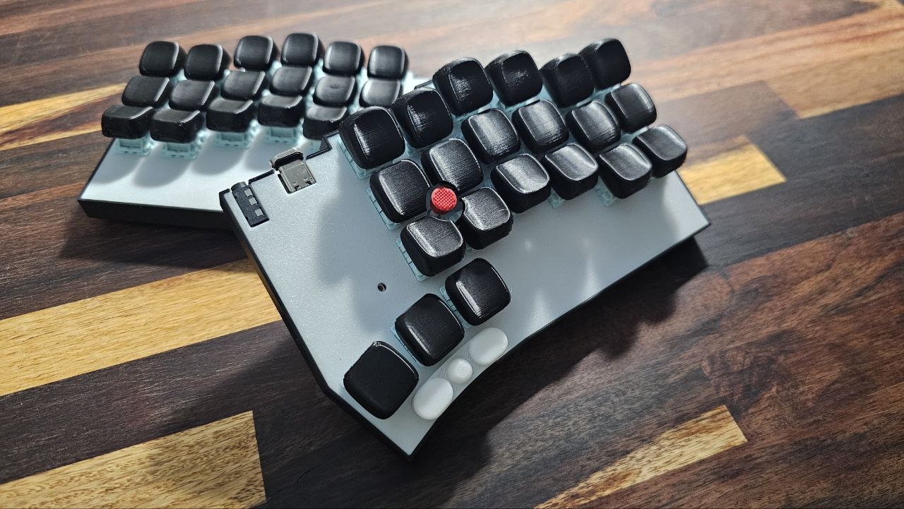
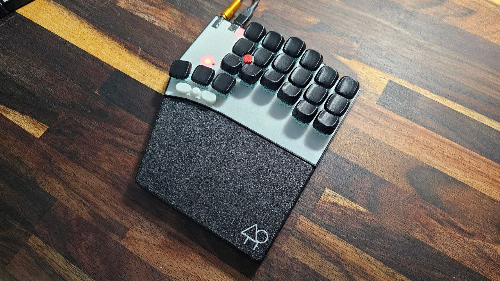
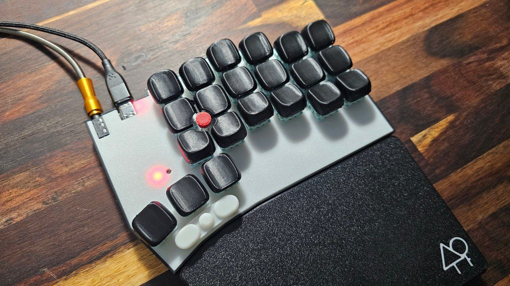
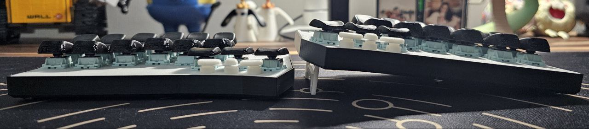

# GeulPan42TP Keyboard

"GeulPan(글판)" means a keyboard.

GeulPan42TP is a split keyboard with 3x6 column staggered keys and 3 thumb keys.
and TrackPoint with 3 keys.

- MCU : YD-RP2040
- Trackpoint Module : 2-piece Tracpoint for X240, X250, X260 X270
    - if using tp mouse btn, can't drag. so need to use QMK Mouse btn
    - Ref [How to integrate a trackpoint in a mechanical keyboard](https://github.com/alonswartz/trackpoint)
- diodeless
- Split and rgblight (YD-RP2040 internal WS2812)
- tenting and palm rest

## Caution

Although I made and am currently using this, there appears to be a bug affecting the trackpoint operation. Therefore, unless using a trackpoint is essential for you, it may be better to consider a different split keyboard.

## Images

