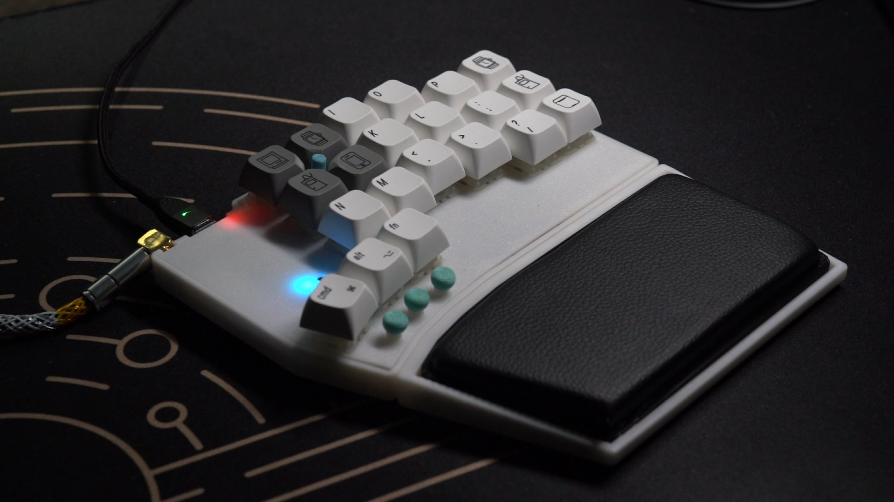

# GeulPan42TP Keyboard

"GeulPan(글판)" means a keyboard.

GeulPan42TP is a 42 keyboard with Trackpoint.

- MCU : RP2040 (i used YD-RP2040 for testing)
- Trackpoint Module : 2-piece Tracpoint for X240, X250, X260 X270
    - if using tp mouse btn, can't drag. so need to use QMK Mouse btn
    - Ref [How to integrate a trackpoint in a mechanical keyboard](https://github.com/alonswartz/trackpoint)
- diodeless
- Split and rgblight(YD-RP2040 internal WS2812)

currently, POC is complete.
I will rework GeulPan42TP to make it easier to build and more ergonomic by relocating the position of the mouse buttons and adjusting the thumb cluster, among other improvements.
