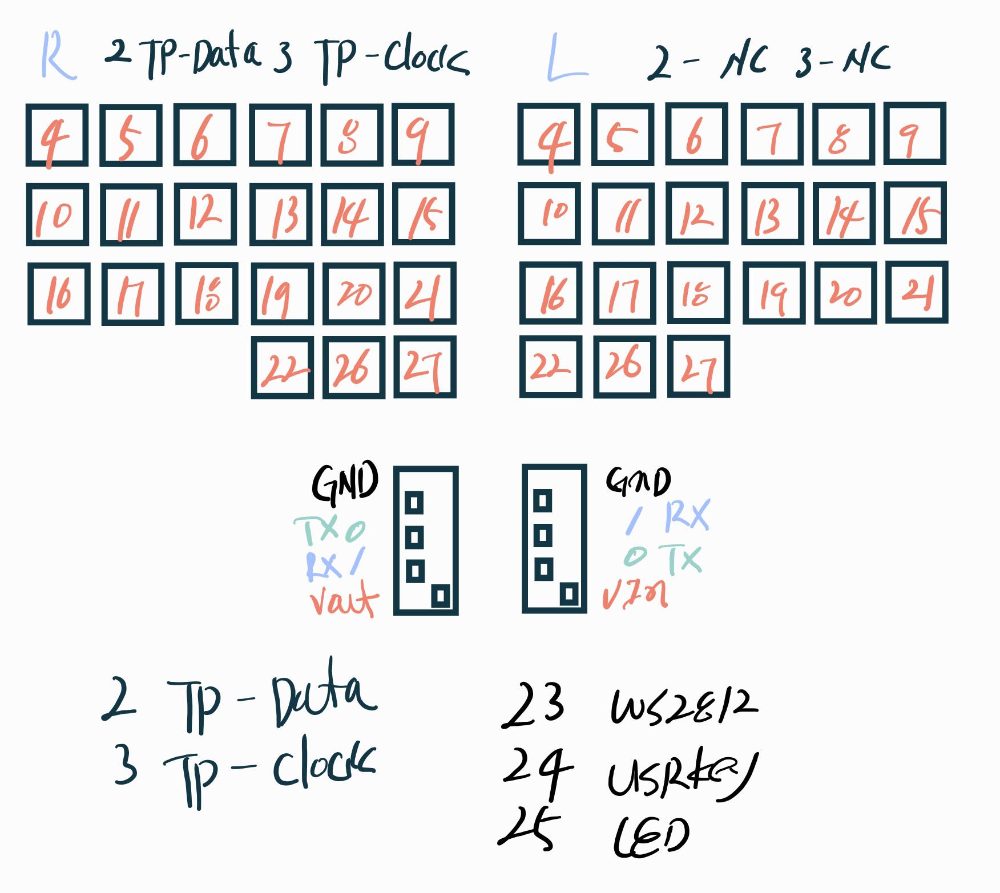

## BOM

MCU : YD-RP2040 (PCB thickness 1.3mm)

TRSS Connector : PJ321A

TrackPoint Module : 2-piece Tracpoint for X240, X250, X260 X270

etc : bumpon SJ5302, M3 insert nut and bolt

## wiring

- diodeless. each pin connects directly to each switch.
- If TX and RX are not crossed during soldering, perform a software-based TX and RX pin swap on the rp2040.
    - #define SERIAL_USART_PIN_SWAP in config.h

## YD-RP2040 WS2812

- if want using WS2812, sodering RGB pad ( or R68)

[YD-RP2040 Information](https://sites.google.com/view/raspberrypibuenosaires/yd-rp2040-16mb)

## stl files

### PCB for handwire and hotswap
files : 01_"01/02"_geulpan_42tp "left/right" v02 mcu "1.3mm/1.7mm"

YD-RP2040 PCB thickness is 1.7mm or 1.3mm from aliexpress.

i made two version, but only tested 1.3mm version. 

### switch plate
files : 02 geulpan 42tp plate "left no tp no mouse/right tp mouse"

TP install only right side. 

### bottom case
files: 03 geulpan 42tp bottom case "v02 H 11mm left/v03 H 13mm left"

V02 height is 11mm, V03 height is 13mm

files: 10 trrs_cable_tester

trrs cable fitting tester

### mouse button
file 1 : 04 geulpan 42tp mouse switch "v02 without ball/v03 external btn"

file 2 : 06 geulpan 42tp trackpoint ball 8mm v02

i used "04 geulpan 42tp mouse switch v03 external btn" with "ball 8mm"

### trackpoint stem and cap
file 1 : 05 geulpan 42tp trackpoint pole mx switch xda keycap v2

file 2 : 06 geulpan 42tp trackpoint ball 8mm v02 

file 3 : 06 geulpan 42tp trackpoint cylinder "5mm-5mm/5mm-6mm"

trackpoint stem for 4.5mm x 4.5mm, and height fit for XDA kaycaps ( i used apple keycaps)

trackpoint caps are using a 'cylinder' shape because the '8mm ball' is causing interference.

### palm(wrist) rest
files : 07 geulpan 42tp palmrest v02 H "11mm/13mm" "left/right"

palm rest for GeulPan42TP

### cushion palm(wirst) rest 

if 3d printed palm rest too hard, you can make a cushioned palm rest. refer to youtube link

https://youtu.be/PRN-l_ACz_Y

