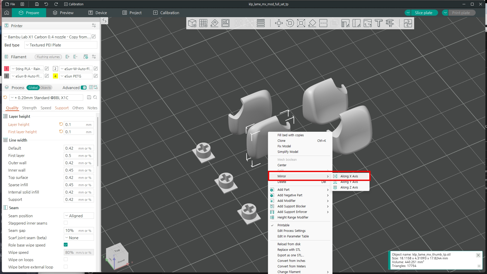

## BOM

### Base

| Part  | Qty | Memo |
| ------------- | ------------- | ------------- | 
| YD-RP2040  | 2  | -  |
| PJ321A  | 2 | -  |

### TrackPoint

TrackPoint Module : 2-piece Tracpoint for X240, X250, X260 X270

| Part  | Qty | Size or Spec |
| ------------- | ------------- | ------------- | 
| 4.7k  | 2  | 1206  |
| 100k  | 1 | 1206  |
| 2.2uF  | 1  | 1206  |
| FFC 12 Pin Connector  | 1  | under contact |
| FFC 8 Pin Connector  | 2  | under contact |
| FFC 8 Pin Cable  | 1  | reverse direction |
| 6x6x3.5  | 6  | -  |

If you're not using an FFC cable, you can also solder it as shown in the picture.

### Case & PalmRest

| Part  | Qty | Size |
| ------------- | ------------- | ------------- | 
| Bolt  | 10  | M3 6mm  |
| Bumpon  | 12  | SJ5032 or 10mm  |
| Mganet | 6  | 6mm x 2mm  |

### Keycaps for Trackpoint

I have modified and created the [KLP Lame Sallde for MX](https://github.com/braindefender/KLP-Lame-Keycaps) keycap. The print settings are as follows:

| Option  | Value | Memo |
| ------------- | ------------- | ------------- | 
| Layer Height  | 0.1 | -   |
| Support  | Tree Support  | -  |

