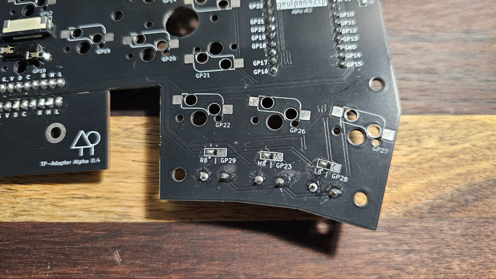

# GeulPan42TP Keyboard

If you can't drag while using the trackpoint, please use "PS2_MOUSE_USE_REMOTE_MODE". 

However, for parts where the trackpoint is not connected, you should use "Stream Mode".

"PS/2 mouse" was not connected, using "remote mode" caused the controller to malfunction.

example : Master Side use "PS2_MOUSE_USE_REMOTE_MODE", Slave Side use "Stream Mode"

If the cursor malfunctions when using "remote mode", please reconnect the keyboard.

As a temporary solution to this problem, I have enabled the option to solder GP28 and GP29.
If you solder GP28 and GP29, you will be able to assign and use QMK mouse buttons.

## TrackPoint movement activate mouse layer

When using the trackpoint, you can use the "Movement Hook" to automatically activate the mouse layer.
The default value is FALSE. This is because it was inconvenient when the trackpoint was often touched while typing.

To activate it, please change the "MOUSE_LAYER_AUTO_ENABLE" item in config.h from FALSE to TRUE.

